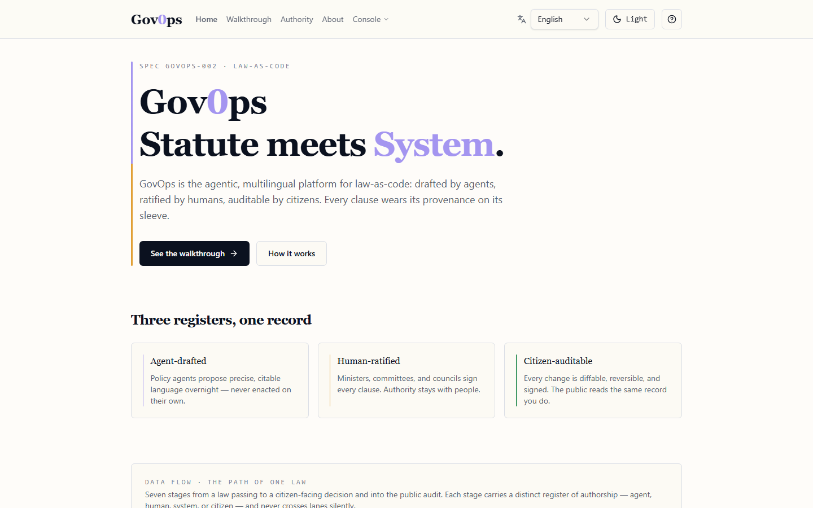
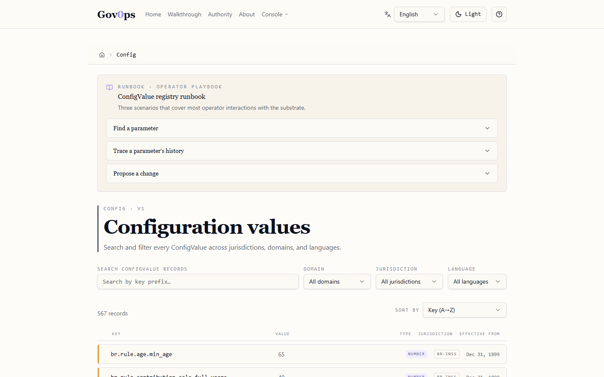
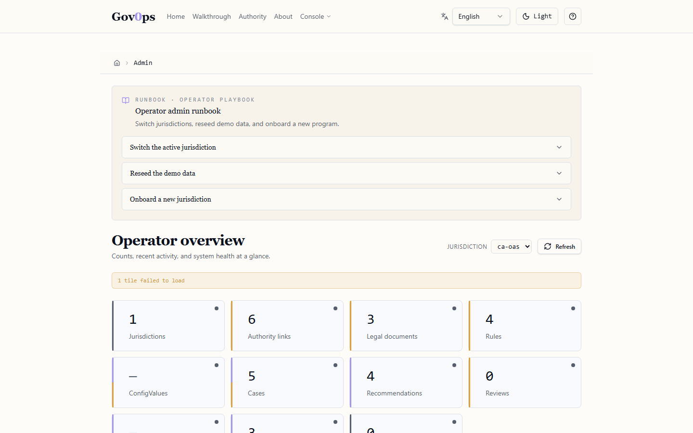
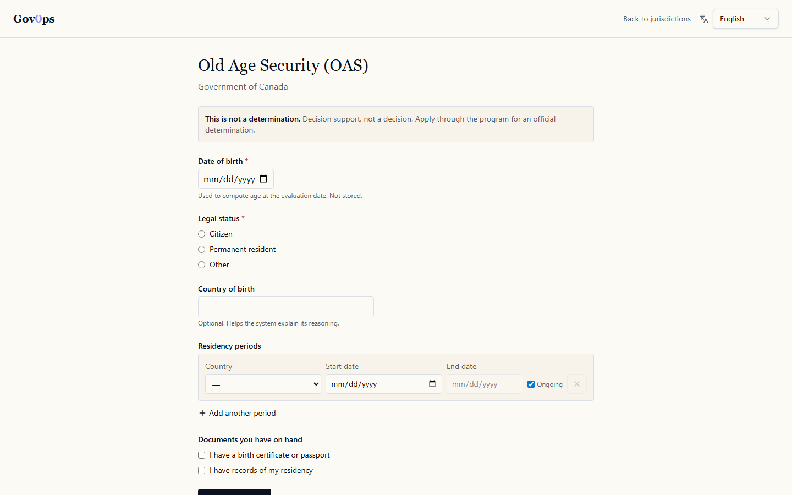
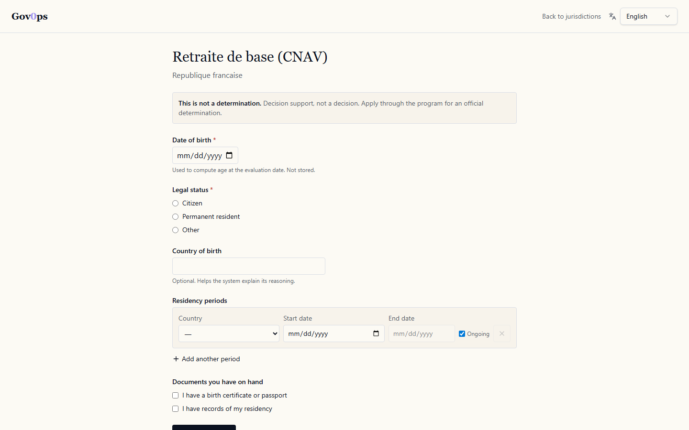

<!--
The block above is Hugging Face Spaces metadata. GitHub renders it as a
YAML code-block at the top of the README. It only takes effect when the
repo is pushed to a Space (huggingface.co/spaces/agentic-state/govops-lac).
For GitHub-only readers, jump past it to the heading below.
-->

# GovOps - Policy-Driven Service Delivery Machine

> **Disclaimer**: This is an independent open-source prototype. It is **not affiliated with, endorsed by, or representing any government, department, agency, or initiative — including SPRIND, the Agentic State paper authors (Ilves, Kilian, Parazzoli, Peixoto, Velsberg), or any of the seven jurisdictions used as illustrative case studies**. The `agentic-state` GitHub organization is an independent open-source implementation effort whose name signals framework alignment, **not authorship or endorsement** by the Agentic State paper authors. Legislative text used in the demo (including the Old Age Security Act) is publicly available law interpreted by the author for illustrative purposes only — it is **not authoritative operational guidance** and should not be relied upon for actual eligibility determinations.

**Law -> Policy -> Service -> Decision**

GovOps turns authoritative governance sources into coherent, traceable, executable service logic. It is a disciplined construction approach for systems whose true specification lives outside the codebase — in statutes, regulations, and policy.

**Law-as-Code v2.0** has shipped: every statutory value (thresholds, accepted statuses, calculation coefficients, prompts) lives as a dated `ConfigValue` record. Behaviour changes are configuration writes, not deploys. A case evaluated against 2025 still resolves with 2025's substrate even after the rules change in 2026. A second repo can publish its own jurisdiction with an Ed25519-signed manifest and federate into a GovOps deployment.

This is an open public-good contribution: a working MVP demo other contributors can fork to build whatever else they need.

**Project home**: [agentic-state.github.io/GovOps-LaC](https://agentic-state.github.io/GovOps-LaC/) · **Source**: [github.com/agentic-state/GovOps-LaC](https://github.com/agentic-state/GovOps-LaC) · **Live demo (v2.1)**: [huggingface.co/spaces/agentic-state/govops-lac](https://huggingface.co/spaces/agentic-state/govops-lac) — _free-tier; first load may take ~30s if idle_

<p align="center">
  <a href="https://agentic-state.github.io/GovOps-LaC/"></a>
  <br><sub><i>The product home — captured from the live v0.4.0 dev server. <a href="https://agentic-state.github.io/GovOps-LaC/">Full gallery on the project home page →</a></i></sub>
</p>

---

## Who is this for?

| If you are… | GovOps gives you… | Start here |
| --- | --- | --- |
| **Policy / legal team** | "Configure without deploy" — change a threshold by drafting a new dated record with citation + rationale; dual approval; full audit | [`docs/design/LAW-AS-CODE.md`](docs/design/LAW-AS-CODE.md) |
| **Citizen** | Self-screen for a benefit without creating a case (no PII stored, no audit row) | [`/screen` walkthrough](https://agentic-state.github.io/GovOps-LaC/) |
| **Auditor** | Every recommendation traces `Decision → Rule → Policy → Regulation → Act → Jurisdiction` with the exact substrate values in effect on the evaluation date | [`/api/cases/{id}/audit`](#api) |
| **Government / contributor** | Fork the repo, drop in your jurisdiction's YAML, run. 7 reference jurisdictions × 6 locales already shipped. | [`CONTRIBUTING.md`](CONTRIBUTING.md) |
| **Researcher / SPRIND-curious** | A working reference implementation against the SPRIND "Law as Code" framework's 5 elements, plus a 6th GovOps adds (versioned interpretive apparatus) | [`docs/design/LAW-AS-CODE.md`](docs/design/LAW-AS-CODE.md) |

For build history and accepted backlog: [`PLAN.md`](PLAN.md). For load-bearing decisions: [`docs/design/ADRs/`](docs/design/ADRs/).

---

## Quick Start

GovOps v2.0 has **two surfaces** during local development. The modern v2 UI is what visitors see in the screenshots; the legacy Jinja UI is preserved as a no-build-step fallback.

```bash
git clone https://github.com/agentic-state/GovOps-LaC.git
cd GovOps-LaC
pip install -e ".[dev]"
```

**Start both surfaces** (two terminals, ~30s setup each):

```bash
# Terminal 1 — backend API + legacy Jinja UI fallback
govops-demo                            # http://127.0.0.1:8000

# Terminal 2 — the v2 React/TanStack/shadcn UI (what's in the screenshots)
cd web && npm install && npm run dev   # http://localhost:8080
```

Open **http://localhost:8080** for the v2 experience (23 routes, 6 locales, parchment-on-ink theme). The Jinja UI at `:8000` is the v0 / v1 fallback retained for "no Node toolchain" demos and is clearly labelled as such.

> **Coming in v2.1**: a single hosted demo URL collapses both surfaces into one process via Docker (FastAPI serves the built React SPA + the JSON API + an LLM proxy). See `memory/v2_1_hosted_demo_plan.md`.

No database server, no cloud, no API keys. Embedded SQLite handles the substrate.

---

## Add your country in 5 minutes (v3 — adoption substrate)

GovOps v3 is built around the idea that adding a jurisdiction should be the same shape as forking a Unix tool: a single command produces a complete skeleton, every value is a TODO marker pointing at the law that fills it, and the test suite tells you when you're done.

### One command, schema-valid skeleton

```bash
pip install -e ".[dev]"
govops init pl --shapes oas,ei
```

This writes:

```
lawcode/pl/
├── jurisdiction.yaml
├── programs/
│   ├── oas.yaml          # program manifest (ADR-014)
│   ├── oas.md            # plain-language sidecar for non-coder review
│   ├── ei.yaml
│   └── ei.md
└── config/
    ├── oas-rules.yaml    # substrate values (per-parameter, dated)
    └── ei-rules.yaml
```

Every TODO marker in those files is a hand-fill point. The skeleton is schema-valid the moment it lands — `pytest` confirms the structure before you touch a single citation. The plain-language sidecars (`*.md`) are generated alongside the YAML so a non-coder program leader can review the encoded rules without reading YAML; regenerate them at any time with `govops docs lawcode/pl/programs/oas.yaml`.

### Zero-toolchain run via `docker compose`

Don't have Python or Node installed?

```bash
docker compose up
```

…brings up the same two-process demo (FastAPI on `:8000`, TanStack UI on `:8080`) on any machine with Docker. Editing `lawcode/<jur>/` on the host hot-reloads inside the container — the contribution loop opens up to anyone who can read law and edit text.

> The `docker-compose.yml` at the repo root and the two images under `docker/` are distinct from the top-level `Dockerfile` (which is the v2.1 hosted-demo single-container image). Use either independently.

---

## What the Demo Does

GovOps ships **two canonical programs across seven jurisdictions** as the working reference implementation. Each program is encoded from the country's own statutes (not literally Canada's law applied elsewhere) and shares a canonical _shape_ — `old_age_pension` for the lifetime monthly benefit, `unemployment_insurance` for the bounded-duration benefit. Switching jurisdictions in the demo swaps in that country's authority chain, citations, and demo cases.

| Jurisdiction | Old-age pension | Employment insurance |
| --- | --- | --- |
| Canada | Old Age Security (OAS Act, R.S.C. 1985, c. O-9) | Employment Insurance (S.C. 1996, c. 23) |
| Brazil | Aposentadoria por Idade (Lei 8.213/91) | Seguro-Desemprego (Lei nº 7.998/1990) |
| Spain | Pensión de jubilación (TRLGSS) | Prestación por desempleo (TRLGSS) |
| France | Retraite de base (CNAV) | Allocations chômage (Code du travail / UNÉDIC) |
| Germany | Regelaltersrente (SGB VI) | Arbeitslosengeld I (SGB III) |
| Ukraine | Пенсія за віком (Закон № 1058-IV) | Допомога по безробіттю (Закон № 1533-III) |
| Japan | Kosei Nenkin Hoken | _(architectural control — see charter)_ |

Japan's pension is fully encoded; its EI is **deliberately absent** as the v3 architectural control proving symmetric extension is a choice, not a requirement.

### The workflow per case:

1. **View** a case — applicant profile, evidence, residency / contribution history
2. **Evaluate** — the rule engine checks each statutory condition deterministically against every program registered for the jurisdiction
3. **Review** — approve, reject, escalate, or request more information (human-in-the-loop)
4. **Audit** — every rule evaluation traces back to its legal citation; cross-program interactions surface as warnings

### v3 surfaces

| Surface | What it does |
| --- | --- |
| `/cases/<id>` | Officer view: per-case eligibility across every program in the jurisdiction |
| `/compare/<program-id>` | Government-leader view: side-by-side parameter table across the active jurisdictions, citation per cell |
| `/check` | Citizen entry: declare a few facts, see every program you may qualify for. No PII stored. |
| `/check/life-event?event=job_loss` | Citizen reassessment: bounded-duration timeline + obligations |
| `/admin/federation` | Operator view: signed lawcode packs from peer publishers |

---

## Architecture

```
                          +------------------+
                          |   Jurisdiction   |
                          | (country, level) |
                          +--------+---------+
                                   |
                          +--------v---------+
                          |   Constitution   |
                          +--------+---------+
                                   |
                    +--------------+--------------+
                    |              |              |
              +-----v----+  +-----v----+  +-----v------+
              |   Act    |  |Regulation|  |  Policy    |
              |(statute) |  |          |  | (guidance) |
              +-----+----+  +-----+----+  +-----+------+
                    |              |              |
                    +--------------+--------------+
                                   |
                          +--------v---------+
                          | Formalized Rules |-----> Rule Engine
                          |  (parameters,    |     (deterministic
                          |   citations)     |      evaluation)
                          +--------+---------+         |
                                   |                   |
              +--------------------+-------------------+
              |                    |                    |
        +-----v------+    +-------v-------+    +------v-------+
        |    Case    |    |Recommendation |    | Audit Package|
        | (applicant,|--->| (outcome,     |--->| (full trace, |
        |  evidence) |    |  rule-by-rule)|    |  immutable)  |
        +------------+    +-------+-------+    +--------------+
                                  |
                          +-------v-------+
                          | Human Review  |
                          | (approve,     |
                          |  reject, etc) |
                          +---------------+
```

### Key design properties:

- **Traceability**: every recommendation links to `Decision -> Rule -> Policy -> Regulation -> Act -> Jurisdiction`
- **Determinism**: identical inputs produce identical outputs in rule-driven paths
- **Evidence awareness**: the system knows what information is needed and what is missing
- **Explicit uncertainty**: missing or contradictory inputs trigger review, not false certainty
- **Human accountability**: humans remain the final decision authorities

### v2.0 substrate

Law-as-Code v2.0 inserts a **dated `ConfigValue` substrate** between the formalized rules and the engine. Every parameter the engine touches — age thresholds, residency minima, accepted legal statuses, calculation coefficients, prompts, UI labels — is resolved through `ConfigStore.resolve(key, evaluation_date, jurisdiction_id)` rather than a hardcoded constant. A case evaluated against 2025 still resolves with 2025's substrate even after the rules change in 2026; the supersession chain is durable.

```
                                                        Federation (Phase 8)
                                                     +--------------------------+
                                                     | Ed25519 signed packs     |
                                                     | publisher allowlist      |
                                                     | lawcode/REGISTRY.yaml    |
                                                     +-----------+--------------+
                                                                 | (verified merge)
                                                                 v
+------------------------+        +------------------------------+-----+
| Formalized Rules       |  ref   |         ConfigValue Substrate      |
| (param_key_prefix +    +------->+   (dated, citation, supersedes,   |
|  citation only)        |        |    rationale, approved_by)        |
+-----------+------------+        +-----------+------------------------+
            |                                 ^
            | engine.evaluate(                | resolve(key,
            |   case, evaluation_date)        |  evaluation_date)
            v                                 |
+------------------------+        +-----------+------------------------+
| Deterministic engine   +------->+ Audit package (full ConfigResolution
| (rule + calculation)   |        | trace per rule, sha256 of notice  |
+------------------------+        | template, supersession chain)     |
                                  +------------------------------------+
```

YAML lives under [lawcode/](lawcode/), validated against [schema/lawcode-v1.0.json](schema/lawcode-v1.0.json) on every push. The encoding pipeline (`govops encode`) emits commit-ready YAML, not Python.

<p align="center">
  <a href="docs/screenshots/v2/09-config.png"></a>
  <br><sub><i>The substrate, in the admin UI: every parameter the engine touches is a dated record with citation + author + approver. Behaviour changes are configuration writes, not deploys.</i></sub>
</p>

### Technology:

**Backend** (`src/govops/`):
- **Python + FastAPI** with **Pydantic** models for the full domain (jurisdiction, authority chain, rules, cases, evidence, audit, ConfigValue)
- **Embedded SQLite** at `var/govops.db` for `ConfigStore` persistence (Phase 6+ per [ADR-010](docs/design/ADRs/ADR-010-sqlite-from-phase-6.md)); legacy in-memory store retained for the case fixtures
- **Schema-validated YAML** for every business value under [lawcode/](lawcode/) — 21 files, 564 records, validated in CI
- **Ed25519** for federation (Phase 8) — signed lawcode packs with publisher allowlist per [ADR-009](docs/design/ADRs/)
- **Jinja2** templates retained as a fallback rendering surface; the primary UI is the `web/` SPA below

**Frontend** (`web/`):
- **TanStack Start** (SSR + flat-route conventions) on **Vite** + **React 19** + **TypeScript**
- **Tailwind v4** + **shadcn/ui** for design-system primitives
- **react-intl** with ICU MessageFormat for 6 locales × ~498 keys; ICU + key-parity validators run as `prebuild`
- **CodeMirror** + **react-diff-viewer-continued** for the ConfigValue admin surface; **react-hook-form** + **zod** for forms
- **Playwright + axe** cross-browser E2E suite covering smoke, admin flow, approval actions, a11y (WCAG 2.1 AA), i18n, and SSR head coverage

---

## API

The demo exposes both a web UI and a JSON API.

### JSON endpoints:

| Method | Path | Description |
| --- | --- | --- |
| GET | `/api/health` | Health check |
| GET | `/api/authority-chain` | Browse the full authority chain |
| GET | `/api/rules` | List all formalized rules |
| GET | `/api/legal-documents` | Browse source legislation |
| GET | `/api/cases` | List all cases |
| GET | `/api/cases/{id}` | Get case with recommendation |
| POST | `/api/cases/{id}/evaluate` | Run the rule engine |
| POST | `/api/cases/{id}/review` | Submit human review action |
| GET | `/api/cases/{id}/audit` | Full audit package |
| GET | `/api/cases/{id}/notice` | Render decision notice (Phase 10C) |
| POST | `/api/cases/{id}/events` | Post a life event for reassessment (Phase 10D) |
| GET | `/api/cases/{id}/events` | List life events for a case |
| GET | `/api/jurisdiction/{code}` | Get jurisdiction metadata + `howto_url` |
| POST | `/api/jurisdiction/{code}` | Switch jurisdiction (ca, br, es, fr, de, ua, jp) |
| GET | `/api/impact` | Citation impact across all jurisdictions (Phase 7) |
| POST | `/api/screen` | Citizen self-screening, no PII echo (Phase 10A) |
| POST | `/api/screen/notice` | Self-screen decision notice (Phase 10C) |
| GET | `/api/config/values` | Browse `ConfigValue` records (Law-as-Code v2.0) |
| GET | `/api/config/resolve` | Resolve a key at an `evaluation_date` |
| GET | `/api/config/versions` | Supersession chain for a key |
| POST | `/api/config/values` | Draft a new `ConfigValue` |
| POST | `/api/config/values/{id}/approve` | Approve a draft (dual approval per ADR-008) |
| POST | `/api/config/values/{id}/request-changes` | Send a draft back |
| POST | `/api/config/values/{id}/reject` | Reject a draft |
| POST | `/api/encode/batches/{id}/emit-yaml` | Encoder commits approved batch to lawcode YAML |
| GET | `/api/admin/federation/registry` | Federation publisher allowlist (Phase 8) |
| GET | `/api/admin/federation/packs` | Fetched lawcode packs |
| POST | `/api/admin/federation/fetch/{publisher_id}` | Pull a signed pack |
| POST | `/api/admin/federation/packs/{publisher_id}/enable` | Enable a verified pack |
| POST | `/api/admin/federation/packs/{publisher_id}/disable` | Disable a pack |

<p align="center">
  <a href="docs/screenshots/v2/12-admin-federation.png"></a>
  <br><sub><i>Federation: a second repo can publish its own jurisdiction as an Ed25519-signed pack. Trust decisions stay in <code>lawcode/REGISTRY.yaml</code> as a YAML PR (per <a href="docs/design/ADRs/ADR-009-federation-trust-model.md">ADR-009</a>); unsigned packs fail closed.</i></sub>
</p>

<p align="center">
  <a href="docs/screenshots/v2/06-screen-ca.png"></a>
  <a href="docs/screenshots/v2/14-screen-fr.png"></a>
  <br><sub><i>Same surface, different jurisdiction: <code>/screen/ca</code> resolves Canada's OAS substrate; <code>/screen/fr</code> resolves France's CNAV substrate. No PII stored, no audit row, no case created.</i></sub>
</p>

### Web UI pages (TanStack Start SPA in `web/`, served at http://localhost:8080):

| Path | Description |
| --- | --- |
| `/` | Landing — Law-as-Code v2.0 hero, console dropdown into the operator surfaces |
| `/about` | What GovOps is, SPRIND framing, FKTE pipeline, authority chain, "what this is not" |
| `/cases` | Case dashboard with event timeline + benefit-amount card on case detail |
| `/authority` | Authority chain browser |
| `/encode` | Rule encoding pipeline (legislative text → proposals → review → YAML emission) |
| `/impact` | Citation impact across all jurisdictions (Phase 7) |
| `/screen`, `/screen/:jurisdiction` | Citizen self-screening — no PII storage, no case row (Phase 10A) |
| `/config` (+ `/timeline`, `/diff`, `/draft`, `/approvals`, `/prompts`) | ConfigValue admin (search, supersession, draft, dual approval, prompt management) |
| `/admin` | Operator surface — seeded data, federation registry, runbook |
| `/admin/federation` | Federation registry + signed pack management (Phase 8) |
| `/walkthrough` | Guided tour of the substrate-as-truth flow |
| `/policies` | Privacy + data handling notice |

The legacy Jinja UI (served at http://127.0.0.1:8000) is preserved as a no-build-step fallback covering `/`, `/cases`, `/authority`, `/encode`, `/admin`, `/mvp`. Interactive API docs: http://127.0.0.1:8000/docs

---

## Conceptual Foundation

### FKTE - Fractal Knowledge Transformation Engine

```
Unstructured knowledge -> Structured knowledge -> Executable knowledge -> Operational action
```

GovOps is the governance-domain instantiation of FKTE.

### Jurisdiction-First Rule

A policy-driven service machine does not start at Acts alone. It starts with the authority context that determines which legal universe applies.

```
Jurisdiction -> Constitution -> Authority -> Law -> Regulation -> Program -> Service -> Decision
```

### Build Order

```
FKTE -> Decision engine -> Service -> Program -> Platform -> GovOps
```

This demo proves step 1: one decision engine for one bounded case type.

---

## Tests

```bash
pip install -e ".[dev]"
pytest -v
```

640 backend tests covering (all green on Python 3.10/3.11/3.12):
- Rule engine unit tests (all decision paths, edge cases, residency calculation)
- Determinism verification (identical inputs = identical outputs)
- Authority traceability (every rule has a statutory citation)
- Multi-jurisdiction switching and evaluation across 7 jurisdictions
- Encoding pipeline (LLM response parsing, proposal review, batch lifecycle, YAML emission)
- API integration tests (full case workflow + Phase 7 impact + Phase 8 federation)
- ConfigValue substrate (round-trip, effective-date semantics, supersession chain)
- Calculation rules (typed-AST formula evaluation, per-step citations)
- Self-screening (citizen-facing, no PII echo, no audit row)
- Notice rendering (template-as-ConfigValue, sha256 in audit)
- Event-driven reassessment (supersession chain, life-event replay)
- Federation (Ed25519 signing, manifest verification, fail-closed pipeline)
- Date-aware substrate resolution (scalar + formula `ref` honour `evaluation_date`)
- v3: program-as-primitive manifest loader + ProgramEngine shape dispatch + bounded-benefit primitives
- v3: cross-program evaluation API + ProgramInteractionWarning + Employment Insurance × 6 jurisdictions
- v3: government-leader comparison surface + citizen entry + life-event reassessment
- v3: `govops init <country>` scaffolder + plain-language sidecar generator

Plus a Playwright + axe E2E suite under `web/e2e/` covering the citizen and operator surfaces.

---

## Project Structure

```
src/govops/
  models.py            # Domain model (jurisdiction, rules, cases, evidence, audit)
  engine.py            # Deterministic rule engine
  seed.py              # Canadian OAS data
  jurisdictions.py     # Brazil, Spain, France, Germany, Ukraine, Japan
  i18n.py              # Multi-language support (en/fr/pt/es/de/uk)
  encoder.py           # Rule encoding pipeline (AI-assisted + human review)
  encoding_example.py  # Pre-loaded encoding demo
  store.py             # In-memory store
  api.py               # FastAPI (JSON API + HTML UI)
  cli.py               # CLI entry point
  templates/           # Jinja2 templates (about, cases, authority, audit, admin, encode, mvp)
  config.py            # ConfigValue substrate (Law-as-Code v2.0)
lawcode/               # Effective-dated ConfigValue records (YAML, schema-validated)
  global/              # Cross-jurisdictional values (engine thresholds, UI labels, prompts)
  {ca,br,es,fr,de,ua,jp}/config/  # Per-jurisdiction rule parameters
schema/
  configvalue-v1.0.json  # JSON Schema for a single ConfigValue record
  lawcode-v1.0.json      # JSON Schema for the lawcode/*.yaml file shape
tests/
  test_engine.py       # Rule engine tests
  test_api.py          # API, multi-jurisdiction, and HTML tests
  test_encoder.py      # Encoding pipeline tests
docs/
  index.html           # GitHub Pages landing page (agentic-state.github.io/GovOps-LaC)
  screenshots/         # Static HTML snapshots of every screen
  ecosystem/           # Implementation guide, training, certification, RFP, use cases, partner program
  design/              # MVP spec, CDD, architecture baselines, ADRs, compliance
```

### Law-as-Code v2.0

Every business value (thresholds, accepted statuses, UI labels, LLM prompts) lives as a dated `ConfigValue` record under [lawcode/](lawcode/). The on-disk shape is locked by [schema/lawcode-v1.0.json](schema/lawcode-v1.0.json); each merged record satisfies [schema/configvalue-v1.0.json](schema/configvalue-v1.0.json). CI runs `python scripts/validate_lawcode.py` on every push, so a malformed YAML breaks the build before merge. Track the live execution plan in [PLAN.md](PLAN.md).

---

## What This Project Is Not

- Not autonomous decision-making
- Not a replacement for legal or policy authority
- Not a hidden-reasoning AI assistant
- Not a claim to automate political judgment

The aim is disciplined decision support: explicit, reviewable, and traceable.

---

## Ecosystem

GovOps is designed to create an ecosystem of implementers, trainers, and domain experts.

| Document | Audience |
| --- | --- |
| [Implementation Guide](docs/ecosystem/implementation-guide.md) | Consulting firms deploying GovOps |
| [Training Curriculum](docs/ecosystem/training-curriculum.md) | Training organizations |
| [Certification Program](docs/ecosystem/certification-program.md) | Individuals and organizations |
| [Business Case Template](docs/ecosystem/business-case-template.md) | Government decision-makers |
| [RFP Template](docs/ecosystem/rfp-template.md) | Government procurement teams |
| [Use Case Library](docs/ecosystem/use-case-library.md) | Anyone exploring GovOps applications |
| [Partner Program](docs/ecosystem/partner-program.md) | Firms building a GovOps practice |

---

## License

Apache 2.0 -- an open public-good contribution for the global public sector.

---

## Origin and Lineage

GovOps was inspired by [The Agentic State — Vision Paper](https://agenticstate.org/paper.html) (Ilves, Kilian, Parazzoli, Peixoto & Velsberg, 2025; v1.0.1, launched at the Tallinn Digital Summit, 09 October 2025), which maps 12 layers of government service delivery where intelligent systems can operate — from service design and workflows through governance, accountability, and public finance.

GovOps is a practical implementation of that vision, starting from Layer 3 (Policy & Rule-Making) and Layer 7 (Agent Governance): a working method that any government can study and adapt to make policy-driven services transparent, traceable, and auditable.

The project also takes [SPRIND's Law as Code initiative](https://www.sprind.org/en/law-as-code) (Germany, headed by Dr. Hakke Hansen, LL.M. and Jörg Resch) seriously and tries to be a working open-source reference implementation against the five foundational elements SPRIND articulates. The element-by-element mapping with code references lives in [docs/design/LAW-AS-CODE.md](docs/design/LAW-AS-CODE.md).

This project is an independent, nights-and-weekends open public-good contribution. It is not affiliated with, endorsed by, or representing the Agentic State authors, SPRIND, or any government — it is one builder's answer to the questions those initiatives pose.

---

## Why This Matters

Public systems drift because legal authority, policy guidance, operational process, and software implementation separate over time.

If one bounded domain can be made coherent again, then modernization becomes a repeatable engineering discipline rather than a bespoke translation exercise.
